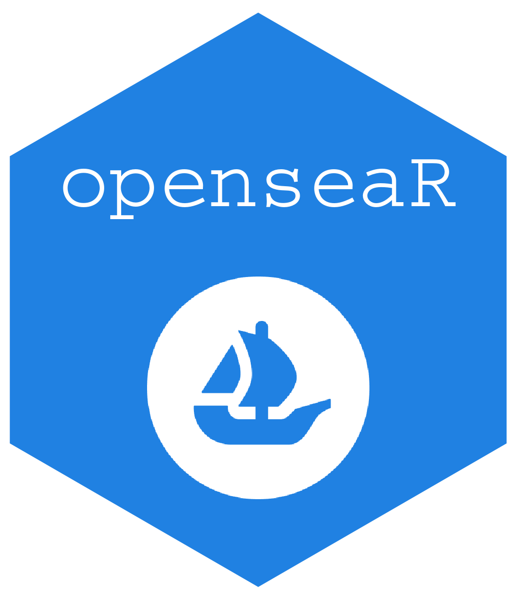

<!-- README.md is generated from README.Rmd. Please edit that file -->

```{r, include = FALSE}
knitr::opts_chunk$set(
  collapse = TRUE,
  comment = "#>"
)
```

# openseaR 

<!-- badges: start -->
[](https://github.com/rwu08/opensear/actions)
<!-- badges: end -->

## Overview 

The OpenSeaR package contains datasets and functions to use in conjunction with the [OpenSea API](https://docs.opensea.io/reference/api-overview). The response from the API is cleaned from the JSON format and transformed into a clean dataframe. 

The package also contains some sample data from [Mutant Ape Yacht Club](https://opensea.io/collection/mutant-ape-yacht-club) which contains event data for 85 unique assets. In addition, sample data containing historical average price of some popular collections are also included. 

Functions inside the package include:

* `read_os_collection`: Takes required API key and optional asset owner address and converts JSON format API call result into dataframe

## Installation 

Install development version from GitHub: 

```{r, message=FALSE, eval=FALSE}
# If you haven't installed remotes yet, do so:
# install.packages("remotes")
remotes::install_github("rwu08/opensear")

```


## Basic usage


```{r}
library(opensear)
```


#### Retrieve data from OpenSea API 


```{r, message=FALSE, eval=FALSE}
total_collection<-read_os_collection(api_key="")
collection_one_owner<-read_os_collection(api_key="",asset_owner="")
```
